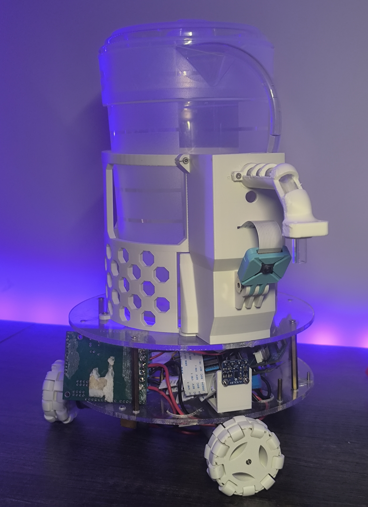
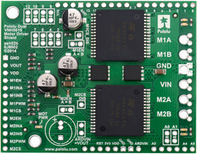
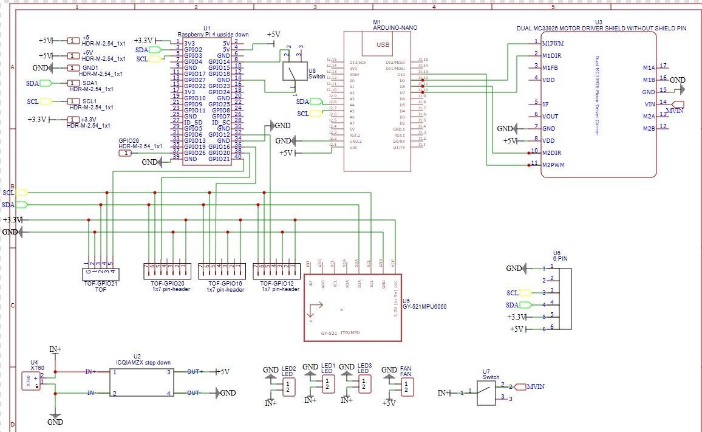
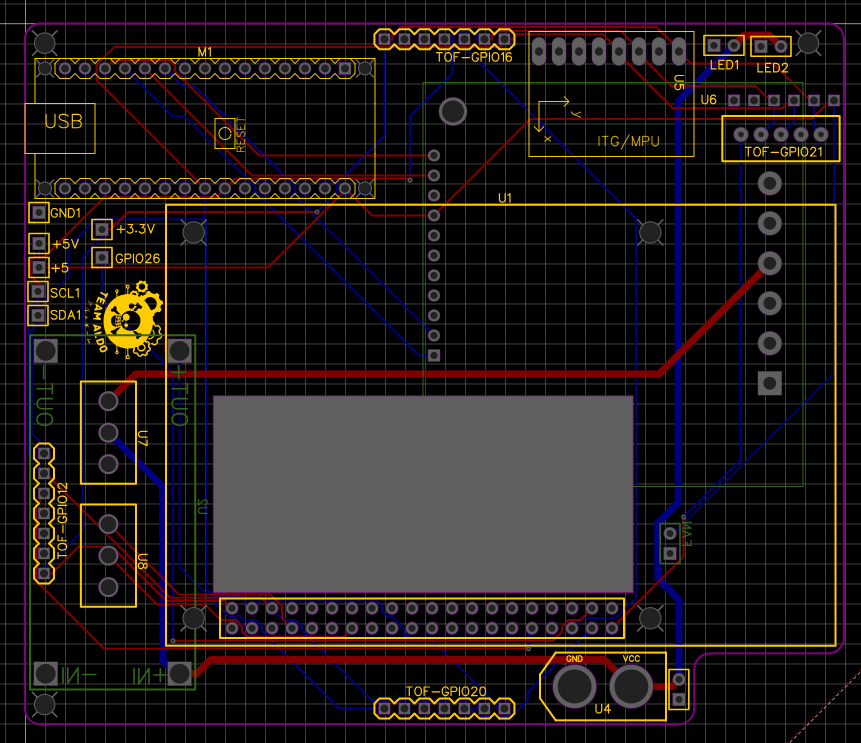
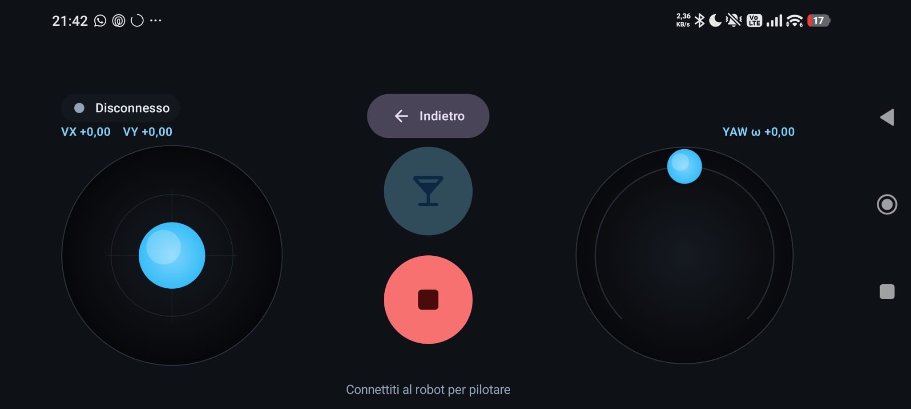
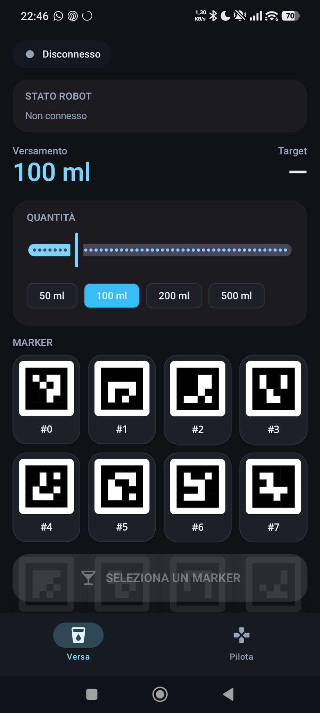

# Versy - Liquid Pouring Robot

Versy is a robotic system featuring an omnidirectional mobile base ([Kiwi Drive](https://en.wikipedia.org/wiki/Kiwi_drive)) and a liquid pump (1 motor), controlled by an MSP432 microcontroller and a Raspberry Pi. Its goal is to autonomously pour liquid into drinks. The system includes an Android companion app for remote manual operation (Joystick) and autonomous tasks (Pouring based on computer vision, Aruco markers, and YOLO segmentation).



---

## 1. Hardware and Software Requirements

### Hardware

* **MSP432P401R LaunchPad**: Real-time microcontroller for PWM generation.<br>
    

* **Motor Drivers**: 2 drivers. An MC33926 driving 2 omni-wheel motors, and a Pololu Dual VNH5019 driving the third omni-wheel motor and the pump.<br>
     

* **Motors**: 3x DC motors for omni-wheels (kiwi-drive) + 1 DC pump.<br>
     

* **ToF**: 1 frontal ToF vl53l0x, used to calibrate the correct distance between the robot and the glass.<br>
    

* **Custom PCB**: A custom PCB recovered from an old project, reused to route power and signals between the MSP432, the Raspberry Pi, the motor drivers, and the sensors.<br>
     

* **Raspberry Pi 4 (with Camera Module)**: Main computation unit, computer vision, and I2C master.<br>
    

* **Android Device**: Smartphone or tablet to run the companion app.<br>
    
* **Chessboard**: A 9x6 inner-corners chessboard (27mm squares) for camera calibration.<br>
    
### Software
*   **Code Composer Studio (CCS)**: To build and flash the MSP432 C firmware.
*   **Python 3.x**: On Raspberry Pi (FastAPI, WebSockets, OpenCV, Picamera2, ONNXRuntime).
*   **Android Studio**: To build the Kotlin/Jetpack Compose Android app.
*   **Ultralytics (YOLOv8)**: For training the computer vision segmentation models.
*   **Fusion 360**: For the 3D CAD design of the robot.
*   **Bambu Studio**: For slicing and preparing the 3D-printed parts.

---

## 2. Project Layout (Source Code Organization)

Here is a breakdown of the most important files driving the logic in each directory:

```text
.
├── msp/                                      # MSP432 firmware (Code Composer Studio project)
│   └── msp_432401r/
│       ├── main.c                            # Main I2C logic and loop
│       └── motor_driver/
│           ├── mc33926_driver.c              # Low-level driver for the MC33926 (PWM, pins)
│           └── mc33926_driver.h              # Header file for the motor driver
│ 
├── raspberry-pi/
│   ├── main.py                               # FastAPI/WebSocket server entry point
│   ├── config/
│   │   └── camera_calibration.py             # Script to run camera calibration
│   ├── machine/
│   │   ├── state_machine.py                  # Core state machine logic (handles transitions)
│   │   └── states/
│   │       ├── init_state.py                 # Initial phase
│   │       ├── scan_state.py                 # Searches for Aruco markers
│   │       ├── moving_state.py               # Approaches the marker
│   │       ├── pouring_state.py              # Vision-based segmentation to pour liquid
│   │       └── retreat_state.py              # Robot returns to home position
│   ├── robot/
│   │   ├── motors.py                         # I2C driver to communicate with the MSP432
│   │   ├── camera.py                         # Picamera2 / OpenCV handler
│   │   └── tofs.py                           # Frontal ToF (VL53L0X) distance sensing
│   ├── vision/
│   │   ├── aruco_detect.py                   # ArUco marker pose estimation and tracking
│   │   └── table_segmentation.py             # YOLOv8 inference for table/cup segmentation
│   └── websocket/
│       ├── server.py                         # WS connections management
│       └── handlers/
│           ├── action_handler.py             # Parses App commands (e.g. move joystick)
│           ├── aruco_handler.py              # Streams detected markers back to the App
│           └── router.py                     # Routes messages to the correct handler
│
├── versy_app/                                # Android Application
│   └── app/src/main/java/com/example/versy_app/
│       ├── MainActivity.kt
│       ├── viewmodel/AppViewModel.kt         # MVVM ViewModel to handle WebSocket and Robot state
│       ├── ui/screens/
│       │   ├── JoystickScreen.kt             # Manual control UI 
│       │   └── PourScreen.kt                 # Autonomous pouring UI (shows camera feed/markers)
│       └── data/
│           ├── RobotSocket.kt                # Socket connection handling in Android
│           └── Messages.kt                   # JSON serializers/deserializers for WS messages
│
└── segmentation/                            # YOLOv8 training & validation (dataset not versioned)
    ├── training/
    │   ├── convert_coco_to_yolo.py           # Converts a Roboflow COCO export to YOLO format
    │   └── train_yolov8_seg.py               # Trains YOLOv8n-seg and exports to ONNX
    ├── inference.py                          # Tests YOLOv8 model inference
    └── val_deployed.py                       # Validates the deployed ONNX model (256px)
```

---

## 3. How to Build, Flash, and Run the Project

### A. MSP432 Firmware
1. Open **Code Composer Studio**.
2. Import the project located in the `msp/` folder into your workspace.
3. Build the project (`Project -> Build Project`).
4. Connect the MSP432 LaunchPad via USB and click the **Debug** (or Flash) icon to flash the firmware.

### B. Raspberry Pi Backend & Camera Calibration
1. Connect to the Raspberry Pi and navigate to the `raspberry-pi` folder.
2. Install picamera2 required libraries:
   ```bash
   sudo apt install python3-libcamera python3-kms-cxx python3-picamera2
   ```
3. Install the required Python packages:
   ```bash
   pip install -r requirements.txt
   ```
4. **Camera Calibration**: Before using vision features, run the calibration script:
   ```bash
   python config/camera_calibration.py
   ```
   * Choose option **1** to capture images. Hold a printed chessboard in front of the camera and press `SPACE` when the corners are highlighted in green (capture ~20 images). Press `ESC` when done. You can use the following photo:
     
   * Choose option **2** to perform the calibration. This will generate a `camera_calibration.npz` file containing the camera matrix and distortion coefficients.
5. Start the main server:
   ```bash
   python main.py
   ```

### C. Android App (Versy App)
1. Open the `versy_app` folder in **Android Studio**.
2. Wait for Gradle synchronization.
3. Connect your Android device (ensure Developer Options and USB Debugging are enabled).
4. Click **Run 'app'** to build and install the APK on your device.

### D. YOLO Segmentation (Optional - Retraining)
1. Navigate to the `segmentation` folder.
2. Ensure you have PyTorch and Ultralytics installed.
3. Run the training, passing the dataset config and a version tag (both used in the run name and the exported ONNX file name):
   ```bash
   python training/train_yolov8_seg.py --data ../yolo_dataset_v4/data.yaml --version v6 --epochs 100
   ```
   The script trains YOLOv8n-seg, validates it, and exports the model to ONNX under `models/trained/`.

---

## 4. User Guide

1. **Power Up**: Turn on the robot base. Ensure both the MSP432 and the Raspberry Pi boot up and the FastAPI server is running.
2. **Connect**: Open the Versy app on your Android device. Go to the Settings panel and insert the IP address of the Raspberry Pi.
3. **Manual Control**: Navigate to the Joystick Screen to manually control the omni-wheels and test the movement.<br>
    
4. **Autonomous Mode**: Place your glass on the personalized Versy coaster. Switch to the Pour Screen to begin the autonomous sequence, where the robot will approach the target (using Aruco and YOLO segmentation) and trigger the pump.<br>
    

---

## 5. Media Links
*   **Slides Presentation**: [Link](https://canva.link/gac6j1pceaj32lf)
*   **YouTube Video**:  [Versy-Video](https://youtu.be/0izqmVGTUHI?si=aVkfisXJMKIOZBLL)

---

## 6. Team Members & Contributions
*   **Daniele Dalla Vecchia**: Camera Calibration, ArUco code detector, kiwi-drive kinematic, MSP432 firmware, I2C communication.
*   **Francesco Fanton**: State Machine logic, Fusion design, 3D printing, software testing and integration.
*   **Mattia Tognato**: State logic (ArUco centering, scan state movement), electronics, cable soldering and cable management.
*   **Riccardo Fanin**: Fusion design, WebSocket communication, segmentation model training and integration, mobile app.
